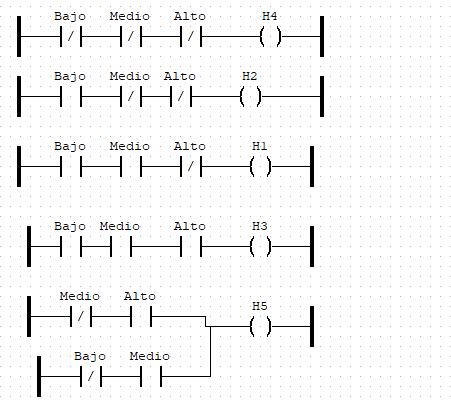
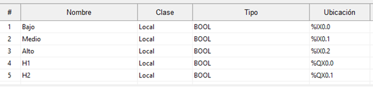

# Workshop-3-Wiki

# 1. Desing HMI in CODESYS

# 2. Validate in OPENPLC

## OPENPLC
Para implementar la solución en OPENPLC, lo primero que se realizo fue implementar la distribución de entradas y salidas, además de las líneas de energía que requiere el programa para simular la entrada de energía en un ambiente industrial.
Se muestra a continuación los diagramas correspondientes a las líneas de energía dentro del programa de OPENPLC:

 
Donde la línea de energía izquierda se refiere a por donde entra la corriente, y la línea derecha es donde se termina el recorrido de corriente, en un ambiente de pruebas este seria el polo a tierra.
A continuación, se muestra lo correspondiente a las entradas:

 
En estas entradas, podemos identificar si serán negadas o entradas normales, algo que es bastante importante para el desarrollo de este WorkShop ya que según la lógica que identificamos en el punto anterior, se necesitan tanto entradas negadas como normales.

Y finalmente, las salidas o bobinas, como se le conoce, estas harán las veces de nuestros leds en la implementación física.

 
De igual manera, esta pieza tiene variedad a la hora de ser seteada, como puede ser normal, negada o entre otras, pero para este WorkShop solo se necesitarán las normales.

Ahora, se crearán las variables, usando el creador de variables ubicado en la parte de arriba de la interfaz de OPENPLC.

 
Ahí, después de presionado el botón de “mas” verde, se podrá observar que se piden los siguientes datos:
-	Nombre
-	Clase
-	Tipo
  
De aquí es importante saber que se deberá poner el nombre con el que esperemos que se identifiquen durante todo el desarrollo, también el tipo, que por ser de tipo lógica Ladder, y como esperamos usarla en la implementación física con entradas y negaciones de voltaje, se declarara tipo Bool, en donde podria ser un valor de 1 o 0 por ejemplo. Para este WorkShop declaramos 3 variables de entrada:
- Baja
- Media
- Alta
  
Y 5 variables de salida:
- H1
- H2
- H3
- H4
- H5

Como ya se identificó las variables a crear y la lógica de la simulación de manera anterior, la simulación constará con la arquitectura que se mostrará a continuación, esta simulación seguirá la misma lógica que presentada anteriormente.

 

Después de tener esta arquitectura en la simulación, se realizó una simulación para comprobar su funcionamiento (prueba incluida en el video de WorkShop)
Después de tener en claro que la simulación funcionaba en el programa, se procedió a buscar documentacion en la misma pagina del desarrollador del programa (1) para poder quemar en nuestro caso, el Arduino Uno con el cual desarrollamos la implementación física.
Luego de hacer la búsqueda de documentacion, y gracias a lo encontrado se conoció que para poder quemar el programa a el Arduino se necesita identificar la ubicación física del pin donde se relacionara, es decir, si quiero que la entrada “Bajo” entre por un pin especifico se tiene que darle cierto código, como es mostrado en la siguiente imagen, estos códigos se encontraron en el enlace de la página del programa (2).

 

Después de terminar este proceso, se presento un problema, y es que se necesitan 5 salidas, y por default el programa solo tiene 4 pines de salida, por lo cual al momento de transferir el programa se tuvo que cambiar la configuración de pines de salidas análogas, a que fuera una salida digital, de modo que los pines utilizados quedo de la siguiente manera:

## Implementación Fisica
 
