# Workshop-3-Wiki

# 1. Desing HMI in CODESYS

## Tabla de estados

Para el diseño del HMI en CODESYS, en primera instancia se desarrolló la lógica en lenguaje Ladder del sistema del tanque de almacenamiento. Como base para esto, se diseñó una tabla de estados que definía cómo se representaría la simulación y cómo estarían distribuidos los distintos estados del sistema:

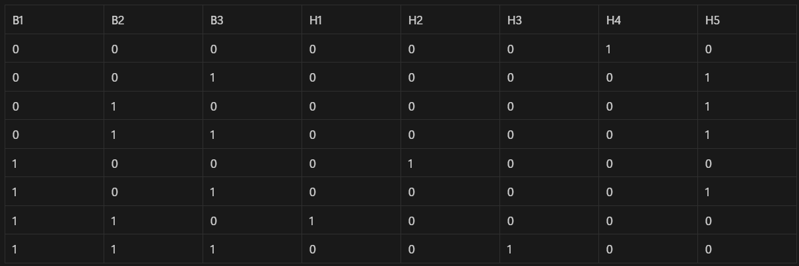

## Lógica de estados

Teniendo en cuenta que, según la tabla, ciertos estados debían representarse de manera directa —por ejemplo, que al activar la palanca de bajo se encendiera el LED correspondiente—, gran parte de la simulación siguió ese enfoque. No obstante, para poder indicar los estados de error, fue necesario implementar una lógica diferente:

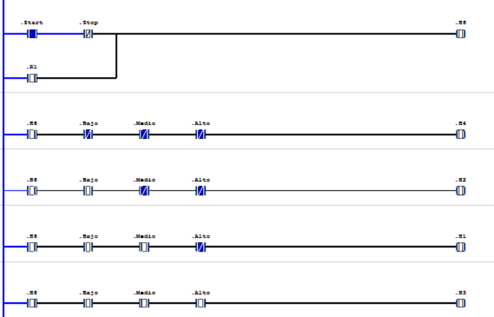

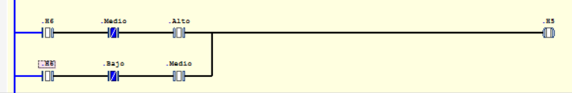

## HMI

Finalmente, teniendo en cuenta el funcionamiento de la lógica implementada, se procedió al desarrollo del HMI, en el cual se utilizaron variables que permitieran representar visualmente la lógica diseñada. El sistema se basó en una lógica de tres estados —"bajo", "medio" y "alto"— en relación con la capacidad de almacenamiento del tanque. Para que se alcanzara el estado de "alto", era necesario haber pasado y mantenido previamente los estados de "bajo" y "medio". Adicionalmente, se incorporaron dos botones con las funciones de encender y apagar el sistema, lo que permitió realizar la simulación de manera completa y efectiva:

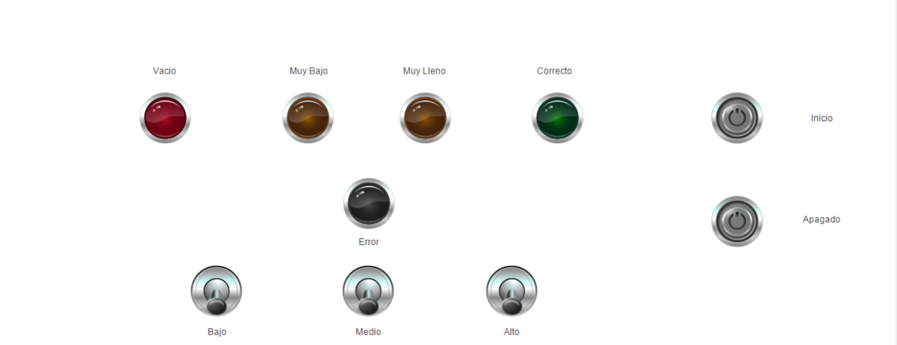

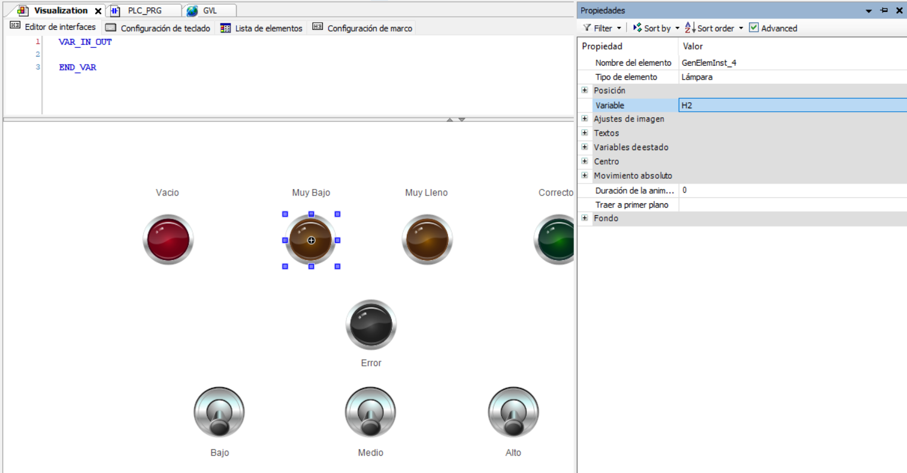

# 2. Validate in OPENPLC

## OPENPLC
Para implementar la solución en OPENPLC, lo primero que se realizo fue implementar la distribución de entradas y salidas, además de las líneas de energía que requiere el programa para simular la entrada de energía en un ambiente industrial.
Se muestra a continuación los diagramas correspondientes a las líneas de energía dentro del programa de OPENPLC:

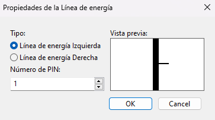
 
Donde la línea de energía izquierda se refiere a por donde entra la corriente, y la línea derecha es donde se termina el recorrido de corriente, en un ambiente de pruebas este seria el polo a tierra.
A continuación, se muestra lo correspondiente a las entradas:

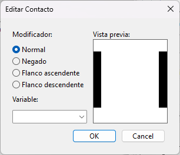
 
En estas entradas, podemos identificar si serán negadas o entradas normales, algo que es bastante importante para el desarrollo de este WorkShop ya que según la lógica que identificamos en el punto anterior, se necesitan tanto entradas negadas como normales.

Y finalmente, las salidas o bobinas, como se le conoce, estas harán las veces de nuestros leds en la implementación física.

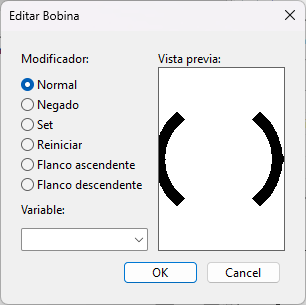
 
De igual manera, esta pieza tiene variedad a la hora de ser seteada, como puede ser normal, negada o entre otras, pero para este WorkShop solo se necesitarán las normales.

Ahora, se crearán las variables, usando el creador de variables ubicado en la parte de arriba de la interfaz de OPENPLC.

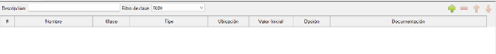
 
Ahí, después de presionado el botón de “mas” verde, se podrá observar que se piden los siguientes datos:
-	Nombre
-	Clase
-	Tipo
  
De aquí es importante saber que se deberá poner el nombre con el que esperemos que se identifiquen durante todo el desarrollo, también el tipo, que por ser de tipo lógica Ladder, y como esperamos usarla en la implementación física con entradas y negaciones de voltaje, se declarara tipo Bool, en donde podria ser un valor de 1 o 0 por ejemplo. Para este WorkShop declaramos 2 variables de entrada:

- Start
- Stop

Estas variables permiten que el sistema funcione al estar encendido o apagado. Luego de eso, se usa internamente una variable R1, la cual no se utiliza en el Arduino como una variable, pero si para darle funcionalidad al sistema. Ademas de eso se utilizaron las siguientes variables de entrada:

- Baja
- Media
- Alta
  
Y 5 variables de salida:
- H1
- H2
- H3
- H4
- H5

Como ya se identificó las variables a crear y la lógica de la simulación de manera anterior, la simulación constará con la arquitectura que se mostrará a continuación, esta simulación seguirá la misma lógica que presentada anteriormente.

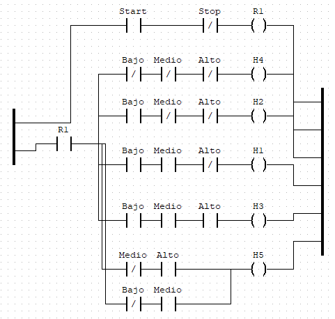

Después de tener esta arquitectura en la simulación, se realizó una simulación para comprobar su funcionamiento (prueba incluida en el video de WorkShop)
Después de tener en claro que la simulación funcionaba en el programa, se procedió a buscar documentacion en la misma pagina del desarrollador del programa (1) para poder quemar en nuestro caso, el Arduino Uno con el cual desarrollamos la implementación física.
Luego de hacer la búsqueda de documentacion, y gracias a lo encontrado se conoció que para poder quemar el programa a el Arduino se necesita identificar la ubicación física del pin donde se relacionara, es decir, si quiero que la entrada “Bajo” entre por un pin especifico se tiene que darle cierto código, como es mostrado en la siguiente imagen, estos códigos se encontraron en el enlace de la página del programa (2).

 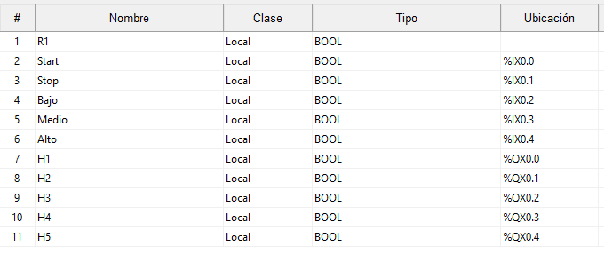

Después de terminar este proceso, se presento un problema, y es que se necesitan 5 salidas, y por default el programa solo tiene 4 pines de salida, por lo cual al momento de transferir el programa se tuvo que cambiar la configuración de pines de salidas análogas, a que fuera una salida digital, de modo que los pines utilizados quedo de la siguiente manera:

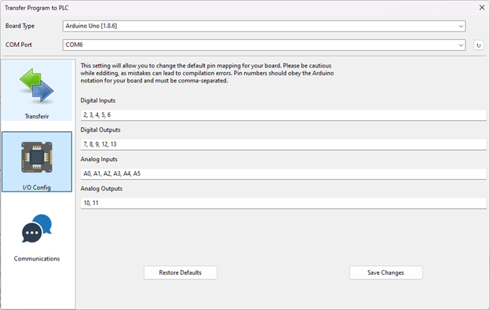

## Implementación Fisica

 Luego de programar el Arduino Uno, según el esquemático que se hablo en el punto anterior, se procedió a realizar el montaje en físico, donde se utilizaron las siguientes entradas:

-	Start: Es el botón de encendido del sistema, ubicado en el pin 2 del Arduino, y este recibe voltaje de un dip switch, que actúa como el botón de encendido.
-	Stop: Es el siguiente pin del dip switch mencionado en el punto anterior, este se encuentra ubicado en el pin 3 del Arduino y actúa como el botón de siempre apagado del sistema.

Ahora, existen también 3 variables de entrada, ubicadas del pin 4 al 6 respectivamente, estas hacen la representación de los valores de agua en el tanque, siendo el pin 4 lo que representa que hay una cantidad baja en el tanque, siendo el pin 5 la representación de cuando el nivel del agua esta es medio y finalmente, el pin 6 cuando el nivel del agua es alto dentro de tanque. Los estados posibles de estas variables son verdadero o falso, es decir si tiene voltaje o no, esta capacidad se genera usando otro dip switch.

Las salidas se manejan desde el pin 7 al 9, y los pines 12 y 13, estas salidas corresponden a lo mencionado anteriormente, pero dicho igual nuevamente, los estados que se muestran atreves de luces leds que corresponden a:

-	Vacío
-	Nivel bajo de agua
-	Nivel medio de agua
-	Nivel alto de agua
-	Error

Y como se puede apreciar, y se lograra de mejor manera en nuestro video explicativo, según las entradas que dejemos entrar al dip switch, se encenderán los niveles que presente el tanque, o si es el caso, el led de error.

Se muestra a continuación el montaje aplicado:

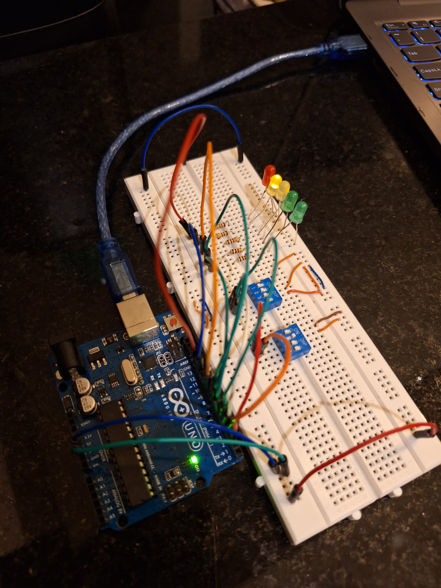

# Referencias
(1) [OpenPLC Overview - Autonomy Logic](https://autonomylogic.com/docs/openplc-overview/)

(2) [Physical Addressing in OpenPLC - Autonomy Logic](https://autonomylogic.com/docs/2-4-physical-addressing/)

